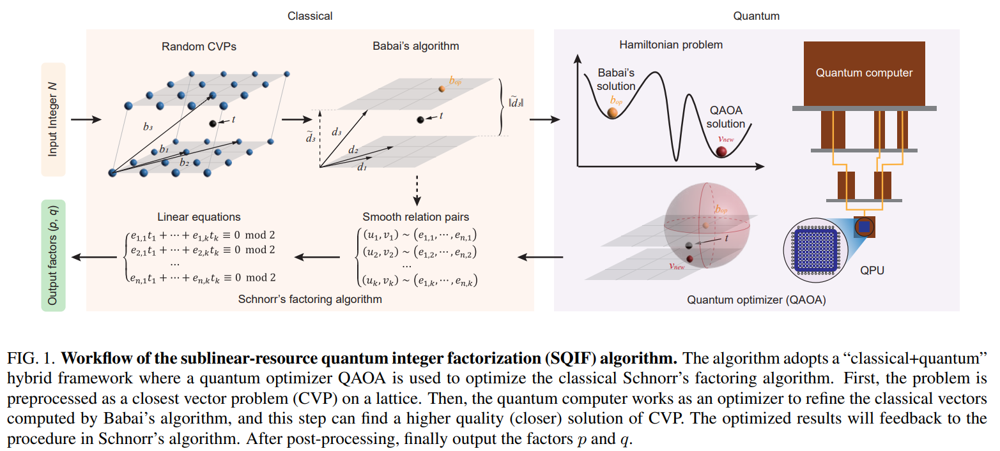
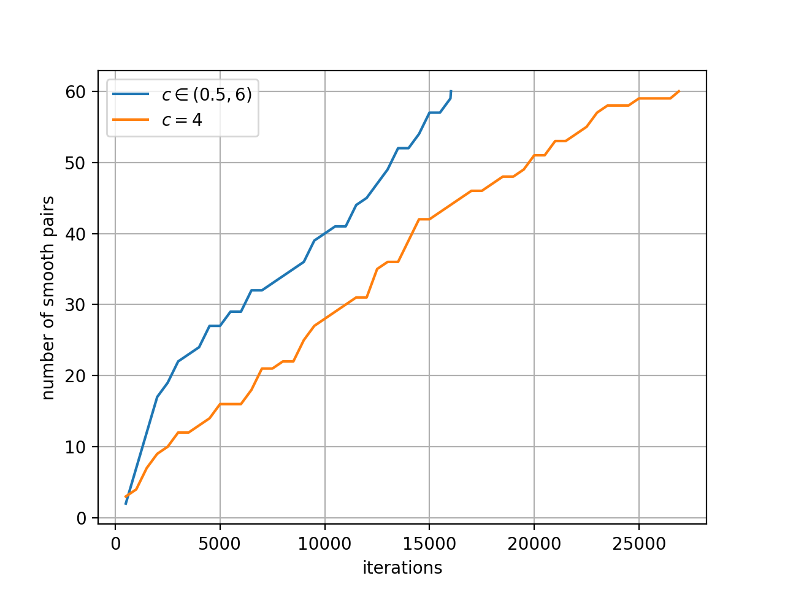
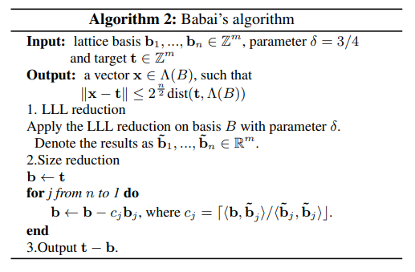
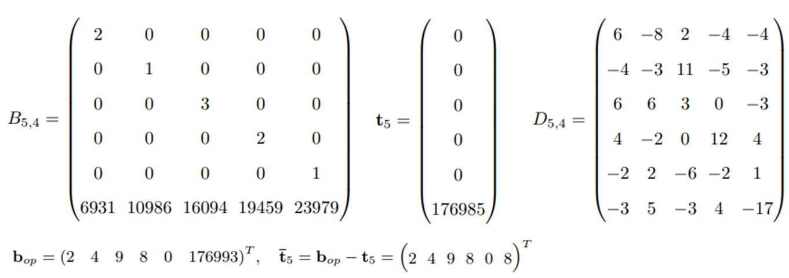
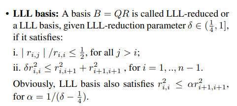
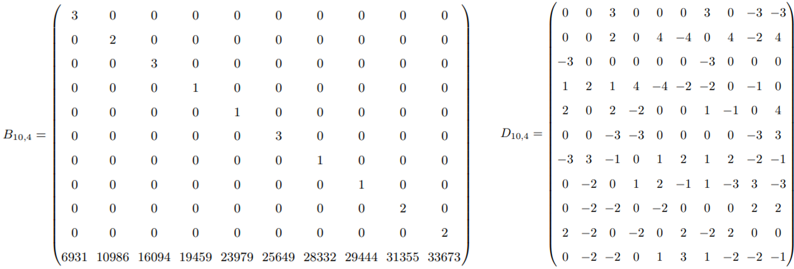
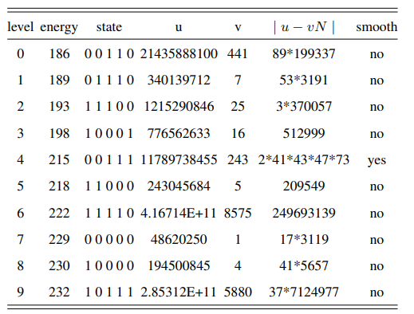

# 基于昇思MindSpore Quantum，实现QAOA加速经典大数因子分解算法

作者：耿力

邮箱：[forcekeng@126.com](forcekeng@126.com)

## 项目描述

RSA（Rivest-Shamir-Adleman）是一种非对称加密算法，它依赖于大数因子分解的困难性质来保护数据的安全。大数因子分解是一种数学问题，即在已知一个极大的合数（通常是两个大素数的乘积）的情况下，寻找这两个大素数的过程。RSA的安全性基于当前计算能力下无法有效地解决这个问题，因此使得RSA成为一种强大的加密工具，广泛用于数据加密和数字签名领域。2022年12月，清华大学龙桂鲁老师团队提出基于量子近似优化算法（Quantum Approximate Optimization Algorithm, QAOA）改善Schnorr格方法的解，该算法称为亚线性资源的量子整数因子分解算法（Sublinear-resource Quantum Integer Factorization, SQIF），具体见论文 [1]。本项目基于 MindSpore Quantum实现 SQIF 并对论文中部分数据进行讨论。

## 数学基础

### 整数因子分解

整数因子分解是一个重要的数学问题，它涉及将一个给定的整数（称为合数）分解成两个或更多个较小的整数（称为因子）的乘积，以求得合数的质因数。具体地，给定一个合数 $N$，整数因子分解问题的数学定义就是要找到整数 $p$ 和 $q$，使得

$$
N = p\times q\tag{1}
$$

其中 $p$ 和 $q$ 都是整数，且不等于 $1$ 或 $N$。这个问题在密码学、数据加密以及计算机安全中至关重要，因为许多加密算法的安全性基于分解大整数的困难性，尤其是在找到两个大素数的乘积的情况下。因此，整数因子分解问题的复杂性对于确保信息安全具有关键性影响。

### 光滑关系对

在因子分解中，光滑关系对（Smooth Relation Pair）是一种数学技巧，通过它可以在大整数分解问题中寻找到小质因子。这个技巧利用了一个观察：大多数整数都能够被分解成一些相对较小的质因子的乘积，这些质因子被称为“光滑数”。通过识别光滑数和它们的组合方式，可以帮助加速整数因子分解的过程。这个概念在一些分解算法中非常有用，例如 Pollard's Rho 算法和 Lenstra Elliptic-curve Factorization 算法，它们利用光滑关系来寻找整数的质因子，从而提高了分解的效率。

- 定义一个整数 $N$ 是 $B$-光滑的，当且仅当 $N$ 的所有质因子都小于 $B$。

- 称两个整数 $(x, y)$ 是关于 $N$ 的 $B$-光滑关系对，当且仅当 $x$ 和 $y$ 都是 $B$-光滑的，且 $x\equiv y \mod N$。

- 称两个整数 $(x,y)$ 是关于 $N$ 的平方同余关系对，当且仅当 $x^2 \equiv y^2 \mod N, x\pm y \not\equiv 0 \mod N$。

如果能获得平方同余关系对，可得 $(x+y)(x-y)\equiv 0 \mod N$，这表明  $x+y$ 以及 $x -y $ 包含着 $N$ 的因数。令 $a=\gcd (x+y, N), b=\gcd (|x-y|, N)$ ，得到的 $a$ 或 $b$ 为 $N$ 的因子，由此实现 $N$ 的分解。

在后续算法中，我们需要让 $(x,y)$ 既是光滑关系对，也是平方同余关系对，此时我们称 $(x,y)$ 是*平方同余光滑关系对*。那如何获得*平方同余光滑关系对*呢？假设已经采样到 $k$ 个光滑关系对 $(x_i, y_i)$ ，且 $x_i, y_i$ 是 $B$-光滑的，即每个光滑数可以分解为不超过 $B$ 的质数 $p_1, p_2, \cdots,p_m$ 的乘积：

$$
x_i = p_1^{e_{i1}} p_2^{e_{i2}}\cdots p_m^{e_{im}},\qquad  y_i = p_1^{e_{i1}'} p_2^{e_{i2}'}\cdots p_m^{e_{im}'}
\tag{2}
$$

由此得到 $k$ 组同余关系对

$$
\begin{gathered}
p_1^{e_{11}} p_2^{e_{12}} \ldots p_m^{e_{1 m}} \equiv p_1^{e_{11}^{\prime}} p_2^{e_{12}^{\prime}} \ldots p_m^{e_{1 m}^{\prime}} \bmod N \\
p_1^{e_{21}} p_2^{e_{22}} \ldots p_m^{e_{2 m}} \equiv p_1^{e_{21}^{\prime}} p_2^{e_{22}^{\prime}} \ldots p_m^{e_{2 m}^{\prime}} \bmod N \\
\ldots \\
p_1^{e_{k 1}} p_2^{e_{k 2}} \ldots p_m^{e_{k m}} \equiv p_1^{e_{k 1}^{\prime}} p_2^{e_{k 2}^{\prime}} \ldots p_m^{e_{k m}^{\prime}} \bmod N
\end{gathered}
\tag{3}
$$

$t$ 是同余方程组的解：

$$
\begin{array}{rrr}
e_{11} t_1+e_{21} t_2+\ldots+e_{k 1} t_k & \equiv 0 & \bmod\ 2 \\
e_{12} t_1+e_{22} t_2+\ldots+e_{k 2} t_k & \equiv 0 & \bmod\ 2 \\
\ldots & \\
e_{1 m} t_1+e_{2 m} t_2+\ldots+e_{k m} t_k & \equiv 0 & \bmod\ 2 \\
\\
e_{11}^{\prime} t_1+e_{21}^{\prime} t_2+\ldots+e_{k 1}^{\prime} t_k & \equiv 0 & \bmod\ 2 \\
e_{12}^{\prime} t_1+e_{22}^{\prime} t_2+\ldots+e_{k 2}^{\prime} t_k & \equiv 0 & \bmod\ 2 \\
\ldots & \\
e_{1 m}^{\prime} t_1+e_{2 m}^{\prime} t_2+\ldots+e_{k m}^{\prime} t_k & \equiv 0 & \bmod\ 2
\end{array}
\tag{4}
$$

当 $k \ge 2m$ 时，方程组 $(4)$ 有非零解。获得解 $\mathbf{t} = (t_1, t_2, \cdots, t_k) \ne \mathbf{0}$ 并代入方程组 $(4)$，此时每个等式左面均为偶数。又

$$
x = \Pi_{i=0}^k x_i =
p_1^{e_{11} t_1+e_{21} t_2+\ldots+e_{k 1} t_k}
p_2^{e_{12} t_1+e_{22} t_2+\ldots+e_{k 2} t_k}
\cdots
p_m^{e_{1 m} t_1+e_{2 m} t_2+\ldots+e_{k m} t_k}\\

y = \Pi_{i=0}^k y_i =
p_1^{e_{11}^{\prime} t_1+e_{21}^{\prime} t_2+\ldots+e_{k 1}^{\prime} t_k}
p_2^{e_{12}^{\prime} t_1+e_{22}^{\prime} t_2+\ldots+e_{k 2}^{\prime} t_k}
\cdots
p_m^{e_{1 m}^{\prime} t_1+e_{2 m}^{\prime} t_2+\ldots+e_{k m}^{\prime} t_k}
\tag{5}
$$

则 $x, y$ 为一系列素数的偶数次幂相乘而成，因此 $x, y$ 为平方数。根据式 $(3)$ 中 $x_i\equiv y_i\mod N$ ，则根据同余数的乘法性质，有 $x\equiv y\mod N$。此时 $(x,y)$ 即为所求的*平方同余光滑关系对*。

### 格方法

上文介绍如果拥有足够多的光滑关系对，通过求解同余方程组，可以构造*平方同余光滑关系对*，那如何获取光滑关系对呢？下文将首先介绍格方法基础知识，然后介绍利用格方法获取光滑关系对的 Schnorr 算法。

在密码学中，格（lattice）是一种数学结构，它在构建一些重要的加密算法和安全协议中发挥关键作用，特别是在基于格的密码学中，如基于最近向量问题（Closest Vector Problem, CVP）的加密方法中。基于任意 $n$ 维度实数空间 $\mathbb{R}^n$ 的基组  $\mathbf{B}=\left(\mathbf{b}_1, \mathbf{b}_2, \ldots, \mathbf{b}_n\right)$ ，定义格

$$
\mathcal{L}=\left\lbrace
\mathbf{B z}: \mathbf{z} \in \mathbb{Z}^n
\right\rbrace
\tag{6}
$$

格问题中一般希望基向量尽可能的“正交”，Hadamard比率描述了格基的“正交”程度，定义为

$$
H(\mathbf{B})=\frac{|\operatorname{det} \mathbf{B}|}{\left\|\mathbf{b}_1\right\| \cdot\left\|\mathbf{b}_2\right\| \ldots\left\|\mathbf{b}_n\right\|}
$$

即格基张成的平行多面体体积与对应的长方体的体积之比。通过对格基作整数系数的线性组合可以提高格的Hadamard比率，称作格约简(reduction)。LLL算法（K.Lenstra, H.W.Lenstra, Jr. and L.Lovasz）是经典的格约简算法。

格上的最近向量问题（Closest Vector Problem, CVP）定义为

$$
\min _{\mathbf{z} \in \mathbb{Z}^n} \quad\|\mathbf{B z}-\mathbf{t}\|
$$

及计算与给定的目标向量 $\mathbf{t}\in \mathbb{R}^n$ 最近的格点，CVP 已被证明为 NP 完备。

著名密码学家Claus P. Schnorr（Schnorr签名的作者）在2021年提出将光滑关系对的采样问题转化为格理论中的最近向量问题（Shortest Vector Problem, SVP），通过原对偶约简（prime-dual reduction）求解 CVP。作者构造的格基和目标向量如下：

$$
\mathbf{B}_{n, f}=\left[\begin{array}{cccc}
f(1) &\cdots &  0 & 0 \\
\vdots & \ddots& \vdots & 0\\
0 & 0 & f(n-1) & \vdots \\
0 & 0 & 0 & f(n) \\
N^{\prime} \ln p_1 & N^{\prime} \ln p_2 & \cdots & N^{\prime} \ln p_n
\end{array}\right]
=[\mathbf{b}_1, \cdots, \mathbf{b}_n],
\quad
\mathbf{t} = \left[\begin{array}{c}
0\\
0\\
\vdots\\
0\\
N'\ln N
\end{array}\right]
$$

其中 $N'$ 为某一常数，论文中取 $N'=N^{1/n}$，$N$ 为待分解的整数，$p_1, \cdots, p_n$ 为前 $n$ 个质数，$f:[1,n]\rightarrow [1, n]$ 为将整数集 $\{1,2,\cdots, n\}$ 进行置换，在算法中每次生成随机置换，本质上 $f$ 是给函数施加一个随机扰动，真正需要求解的部分为式x最后一行，即

$$
\begin{aligned}
& e_1 N'\ln p_1 + e_2 N'\ln p_2 +\cdots + e_n N'\ln p_n = N'\ln N\\
& \Rightarrow N = p_1^{e_1} p_2^{e_2}\cdots p_n ^{e_n}
\end{aligned}
$$

每个格点 $\mathbf{b} = \sum_{i=1}^n e_i \mathbf{b}_i$ 编码了潜在的光滑关系对 $(u, v)$

$$
u = \prod_{e_i > 0}p_i ^{e_i},\quad v = \prod_{e_i < 0}p_i^{-e_i}
$$

记作 $(u,v)\sim \mathbf{b}$。通过求解方程 $\mathbf{B}_{n, f} \mathbf{e} = \mathbf{t}$，获得整数系数 $\mathbf{e}$，检查 $(u,v)$ 是否为光滑对，如果是，则记录，如果不是，利用 $f$ 的随机性或改变 $f$ 或 $N'$，重新生成 $\mathbf{B}_{n,f}$ 或 $\mathbf{t}$，重复上述过程直至获得足够多的光滑对。

针对式x中的矩阵和系数，Bao Yan 等[论文2]中取 $f(i),\ i=1,\cdots, n$ 为元素 $[\sqrt{\ln p_1}, \sqrt{\ln p_2},\cdots, \sqrt{\ln p_n},]$ 的随机置换，$N' = N^c$，其中 $c$ 是一个可调参数。这与 Schnorr 提出的方法并没有本质差异。

### QAOA

量子近似优化算法（Quantum Approximate Optimization Algorithm，QAOA）是一种用于解决组合优化问题的量子计算算法。它被设计用来在量子计算机上寻找近似解，特别是对于NP难问题，如旅行商问题、图着色问题、集合覆盖问题等。QAOA的基本思想是构建一个参数化的量子电路，该电路包含了一系列旋转门和混合层。这些参数化门的参数可以调整，以最大程度地接近问题的最优解。

## SQIF算法

### 算法流程

如图所示，整个算法流程可以分为左面经典（Classical）和右面的量子（Quantum）两部分。算法输入为整数 $N$，输出为分解的结果 $(p,q)$。经典部分即为 Schnorr's 分解算法，在没有量子算法时，经典算法也能得到球的分解结果。量子部分即为QAOA算法，仅对经典部分求出的一些解进行优化，以期望能获得更多*光滑关系对*，这是因为并非每次随机生成的格基都能保证得到的两个数是*光滑关系对*，因此需要反复尝试多次。QAOA期望提供一个方法，即能将经典Babai's算法的结果处理，使得获得*光滑关系对*的概率更大。后文将具体描述该算法。



如上图所示，Schnorr's分解算法的输入、输出和算法步骤步骤：

- input: 带分解的整数 $N$。

- output: $N$ 的分解结果 $p,q$，即 $N = p\times q$。

- step 1: 根据 $N$ 构造随机的 CVP 问题，即产生一组格基 $B_{n,f}$ 和目标向量 $t$。

- step 2: 使用 Babai's 算法求解该 CVP 问题，格基坐标 $b_{op}$，求得对应的整数对 $(u_i, v_i)$ ，检测该整数对是否是*光滑关系对*，如果是，则记录，如果不是，则返回 step 1。其中使用到 LLL-reduction 算法，即使用 LLL-reduction 之后的基为 $D = [d_1, \cdots, d_n]\in Z^{m\times n}$。

- step 3: 收集到足够多（通常为 $k\ge 2m$，其中 $k$ 为*光滑关系对*数量，$m$ 为质数数量）光滑对后，求解线性同余方程，得到解 $e$。

- step 4: 根据 $e$ 计算得到因子 $p, q$ ，如果 $p,q$ 是 $N$ 的*非平凡因子*（不为 1 或 $N$），则分解成功，否则返回 step 1。

事实上，SQIF 算法使用 QAOA 优化了 Babai's 算法的解，表达式为

$$
v_{new} = \sum_{i=1}^n (c_i + r_i) d_i = \sum_{i=1}^n r_i d_i + b_{op}
$$

其中 $r_i\in \{-1, 0, 1\}$ 为扰动。

QAOA 部分算法可以分成以下步骤：

- input: （1）Schnorr's算法中 step 2 获得的整数对 $(u_i,v_i)$ 在格基下的坐标 $b_{op}$ 及其对应的系数 $\mu_j, j=1,\cdots, n$。

- output: 新的坐标 $b_{op}'$，对应的可以获得整数对 $(u_i', v_i')$。

- step 1: 根据 $b_{op}$ 和对应系数 $\mu_j$ ，构建哈密顿量和变分量子线路。

- step 2: 使用经典-量子混合方式更新量子线路参数，直至达到指定收敛条件或最大迭代次数。

- step 3: 重复多次采样，获取出现最频繁（通常对应能量最低）的量子态编码 $x$，通过 $x$ 计算出更新后的值 $b_{op}'$。

### Schnorr 算法代码实现

根据上述代码实现，给出算法实现接口如下：

- Schnorr's 算法中的光滑对配置。

```python
@dataclass
class SchnorrConfig:
    cap_n: int               # The integer N that will be factorized.
    smooth_b1: int = 5       # The number of primes, e.g it's 4, means the maximum prime is 7 since the prime list is [2, 3, 5, 7, 11, ...].
    # The second number of primes, in paper it's `2 * (smooth_b1^2)`, make sure `smooth_b2 >= smooth_b1`.
    smooth_b2: int = 5
    max_iter: int = 1e6      # The maximum number of iterations
    # The number of smooth-pair that will sample, if None, it will be set as 2*smooth_b2
    n_pair: int = None
    base: int = 10           # The base used in the last line of CVP matrix.
    pwr: float = None        # The power used in the last line of CVP matrix.
    # Random sample `pwr` from `pwr_range` when `pwr` is None.
    pwr_range: Tuple = (0.5, 6.0)
    # Search type that optimizes the root of babai's algorithm.
    search_type: SearchType = SearchType.NONE
    # Only valid when `search_type` is `SearchType.QAOA`.
    qaoa_config: QAOAConfig = None
```

- 构建 CVP 中的格基和目标向量。

```python
def construct_lattice(cap_n: int, n_basis: int, pwr: float, base=Optional[None], primes=None):
    """Construct lattice initial basis and target vector.

    Args:
        cap_n (int): The big integer number that will be factorized.
        n_basis (int): Number of basis.
        pwr (float | int): The power of base.
        base (None | int): The base number.

    Return:
        lat_basis (np.ndarray): shape=(n+1, n). The lattice basis. Each column is a base vector.
        t (np.ndarray): shape=(n+1,1). The target vector.
    """
    ......
    return lat_basis, t
```

- LLL-reduction 约简。代码实现中发现，LLL-reduction 约简过程耗时大，是 Schnorr's 算法的耗时瓶颈。使用 `numba` 的 `njit` 加速，可相对原始的 python 代码快 4 倍左右。使用 [fpylll](https://github.com/fplll/fpylll) 速读相对使用 `numba` 加速 Python 能提高数十倍数。例如针对  37 bit 长度的 `N = 78742675849` ，取质数数量为 `n_prime = 25`，使用自己实现的 LLL-reduction 函数每 500 次采样大约需要 130 秒，使用 `numba` 加速后大约需要 40 秒，使用 `fpylll` 库仅需要 0.5 秒左右。为了便于参考，此处给出自己实现的方法和使用 `fpylll` 实现的方法。

```python
# 自己实现的 LLL-Reduction
@njit
def lll_reduction(lat_basis, delta=0.75):
    """LLL-Reduction for lat_basis.

    Args:
        lat_basis: The lattice basis.

    Return:
        lll_basis: The LLL-reduction basis.
    """
    lll_basis = lat_basis
    n = lat_basis.shape[1]
    while True:
        mat_c = gram_schmidt(lat_basis)
        for i in range(1, n):
            bi = lat_basis[:, i]
            for j in range(i-1, -1, -1):
                cj = mat_c[:, j]
                mu_ij = np.dot(bi.flatten(), cj.flatten()) / np.dot(cj.flatten(), cj.flatten())
                lat_basis[:, i] -= np.round(mu_ij) * lat_basis[:, j]
        stop = True
        for i in range(n-1):
            mat_ci = mat_c[:, i].flatten()
            mu = np.dot(lat_basis[:, i+1].flatten(), mat_ci) / np.dot(mat_ci, mat_ci)
            tmp = (mu * mat_c[:, i] + mat_c[:, i+1]).flatten()
            if delta * np.dot(mat_ci, mat_ci) > np.dot(tmp, tmp):
                col = lat_basis[:, i].copy()
                lat_basis[:, i] = lat_basis[:, i+1]
                lat_basis[:, i+1] = col
                stop = False
                break
        if stop:
            break
    return lll_basis
```

调用 `fpylll` 库实现 LLL-reduction：

```python
def lll_reduction_fpylll(lat_basis, delta=0.75):
    """LLL-reduction realized by `fpylll` library [https://github.com/fplll/fpylll], which is about 10x faster.
    The LLL-reduction is a time-comsuming part in Schnorr's algorithm.

    Args:
        lat_basis: The lattice basis.

    Return:
        lll_basis: The LLL-reduction basis.
    """

    mat_b = IntegerMatrix.from_matrix(np.round(lat_basis.T).astype(int).tolist())
    mat_b = LLL.reduction(mat_b, delta=delta)
    m, n = mat_b.nrows, mat_b.ncols
    lll_basis = np.zeros((m, n), dtype=int)
    mat_b.to_matrix(lll_basis)
    lll_basis = lll_basis.astype(np.float64).T
    return lll_basis
```

- Babai's 算法。输入为 Lattice 基 `lat_basis`、目标向量 `t` 和算法的系数 `delta`。返回值为最近向量 `bop` 和系数向上或向下取整对应的符号 `symbol`，`symbol` 的每个元素取值为 `{-1,1}`，用于 QAOA 中确定映射哈密顿量。

```python
def babai_algorithm(lat_basis, t, delta=0.75):
    ......
    return bop, symbol
```

- 获取光滑对。根据 Babai's 算法得到的最近向量 `bop`，计算对应的关系对 `(u, v)` ，检测是否满足光滑关系。

```python
def get_smooth_pair(cap_n: int, lat_basis, bop, primes: List[int], int_dtype=np.int64):
    """Get smooth pair by given lattice basis and closest vector.

    Args:
        cap_n: The integer N.
        lat_basis (np.ndarray): shape=(n+1, n). Lattice basis.
        bop (np.ndarray): shape=(n, 1). The closest vector.

    Return:
        is_smooth (bool): If the result is a smooth-pair.
        x_e (list): Only valid when `is_smooth` is True. The power of first factor.
        y_e (list): Only valid when `is_smooth` is True. The power of second factor.
    """
    ......
    return is_smooth, (x_e, y_e)
```

- 光滑对采样。根据配置函数，采集光滑对。最终返回值 `e_mat` 对应式 $(4)$ 方程的系数。

```python
def smooth_pair_sampling(config: SampleConfig, verbose=0):
    """Smooth pair sampling. It's the most time consuming part.

    Args:
        config: Sample config.
        verbose: If it > 0, there are some log output.
    """
```

- 求解同余方程组。Schnorr 算法中选取一些光滑对进行组合，以构造平方同余光滑关系对，里面涉及求解同余方程组 $(4)$，此处实现高斯消元法求解，并通过回溯方式返回所有非零解。最终解保存在 `self.solutions`。

```python
class XORLinearSystemSolver:
    """Solve the linear system.
    """
    def __init__(self, exclude_zero=True):
        self.mat_m = None              # The solve matrix
        self.mat_m_bak = None          # Back the solve matrix
        self.n = -1                    # The number of variable
        self.has_solution = True       # If there's a solution
        self.exclude_zero = exclude_zero  # Exclude the zero vector
        self.solutions = []            # The solutions.

    def _gaussian_eliminate(self):
        """Gaussian eliminaton method. This function will modify `self.mat_m`.
        """

    def _get_all_solutions(self, r: int, so: List):
        """Get all solutions.

        Args:
            r: The last row index where this line is not all zero.
            so: The current solution.
        """

    def _get_last_nonzero_row(self) -> int:
        """Find the last row that is not all zero.

        Return:
            rr: The last row index where this line is not all zero.
        """

    def validate(self):
        """To verify all solutions. It's optional.
        """

    def solve(self, mat_m):
        """
        mat_m: shape=(m, n+1). The binary xor linear equations which the first n columns is
            the coefficient and the last column is target vector. All elements in `mat_m` is
            in {0, 1}.
        """

    def __call__(self, mat_m):
        """Solve the linear system `mat_m`
        """
        return self.solve(mat_m)

```

### QAOA 代码实现

实现 QAOA，优化 Babai's 算法的解。其接口如下：

```python
class QAOASearch:
    """QAOA Search in SQIF algorithm.
    """

    def __init__(self, config: QAOAConfig):
        """
        Args:
            config: The QAOA configuration.
            verbose: If it's greater than 0, then output some log. Otherwise no output.
        """
        self.config = config
        self.verbose = config.verbose
    ...
    def run(self, mat_d, diff, s, bop):
        """The outer interface that get the disturbance.
        Args:
            mat_d: The LLL-reduced matrix.
            diff: The difference between target vector and the closest vector.
            s: The symbol which element is in {-1, 1}.
            bop: The closest vector from Schnorr's algorithm.
        Return:
            vnew: The new closest vector optimized based on `bop`.
        """

    def __call__(self, mat_d, diff, s, bop):
        return self.run(mat_d, diff, s, bop)
```

使用 QAOA 优化例子如下：

```python
if __name__ == "__main__":
    mat_d = np.array(
        [[1, -4, -3],
         [-2,  1,  2],
         [2,  2,  0],
         [3, -2,  4]], np.float64)

    config = QAOAConfig(n_layer=5, max_iter=8001, verbose=1)
    qaoa = QAOASearch(config)

    diff = np.array([0, 4, 4, 2], np.float64).reshape((-1, 1))
    s = np.array([-1, -1, -1], np.float64)
    t = np.array([0, 0, 0, 240], np.float64).reshape((-1, 1))
    bop = np.array([0, 4, 4, 242], np.float64).reshape((-1, 1))
    vnew = qaoa.run(mat_d, diff, s, bop)
    print(f"target vector `t`:\n{t.ravel().tolist()}")
    print(f"schnorr's algorithm closest vector `bop`:\n{bop.ravel().tolist()}")
    print(f"new vector `vnew`:\n{vnew.ravel().tolist()}")
    print(f"norm(bop - t) = {np.linalg.norm(bop - t):.2f}")
    print(f"norm(vnew - t) = {np.linalg.norm(vnew - t):.2f}")
```

输出为：

```log
Built hamiltonian is:
 -3/2 [Z0] +
-7/2 [Z1] +
-4 [Z2] +
-4 [Z0 Z1] +
5/2 [Z0 Z2] +
3 [Z1 Z2]
Iter [0]: loss = 0.082
Iter [800]: loss = -9.410
Iter [1600]: loss = -9.527
Iter [2400]: loss = -9.534
Iter [3200]: loss = -9.549
Iter [4000]: loss = -9.727
Iter [4800]: loss = -9.808
Iter [5600]: loss = -9.813
Iter [6400]: loss = -9.813
Iter [7200]: loss = -9.813
Iter [8000]: loss = -9.813
It spends 11.90 seconds to train.
shots: 1000
Keys: q2 q1 q0│0.00   0.168       0.335       0.503        0.67       0.838
──────────────┼───────────┴───────────┴───────────┴───────────┴───────────┴
           000│▒
              │
           001│▒
              │
           011│▒▒▒▒▒▒▒▒▒▒▒▒▒▒▒▒▒▒▒▒▒▒▒▒
              │
           100│▓▓▓▓▓▓▓▓▓▓▓▓▓▓▓▓▓▓▓▓▓▓▓▓▓▓▓▓▓▓▓▓▓▓▓▓▓▓▓▓▓▓▓▓▓▓▓▓
              │
{'000': 5, '001': 1, '011': 324, '100': 670}

target vector `t`:
[0.0, 0.0, 0.0, 240.0]
schnorr's algorithm closest vector `bop`:
[0.0, 4.0, 4.0, 242.0]
new vector `vnew`:
[3.0, 2.0, 4.0, 238.0]
norm(bop - t) = 6.00
norm(vnew - t) = 5.74
```

可见 QAOA 的损失不断降低，经过 8000 次迭代，最终测量 1000 次，坍塌在 `100` 态的次数最多，因此该态很可能是能量最低状体。使用该状态优化 Schnorr's 算法的解，可见得到的向量 $v_{new}$ 与目标向量的距离为 5.74，比 $b_{op}$ 更接近 $t$，因此 QAOA 找到更优的解。

### 暴力搜索实现

根据 QAOA 中扰动仅仅取 $\{-1, 0, 1\}$，因此遍历所有可能扰动，暴力求解最优解，该最优解一定不会比 QAOA 的结果更差。之所以实现该搜索，是防止 QAOA 训练不充分等导致未能找到最优解。然而后续结果发现，即使使用暴力搜索每次获得最优解，也不能有效改善 Schnorr's 算法。暴力搜索接口如下：

```python
class BruteForceSearch:
    def run(self, mat_d, diff, bop):
        """The outer interface that get the disturbance.
        Args:
            mat_d: The LLL-reduced matrix.
            diff: The difference between target vector and the closest vector.
            s: The symbol which element is in {-1, 1}.
            bop: The closest vector from Schnorr's algorithm.
        Return:
            vnew: The new closest vector optimized based on `bop`.
        """

    def __call__(self, mat_d, diff, bop):
        return self.run(mat_d, diff, bop)
```

使用和 QAOA 相同的例子，代码如下：

```python
if __name__ == "__main__":
    mat_d = np.array(
        [[1, -4, -3],
         [-2,  1,  2],
         [2,  2,  0],
         [3, -2,  4]], np.float64)

    bf = BruteForceSearch()
    diff = np.array([0, 4, 4, 2], np.float64).reshape((-1, 1))
    s = np.array([-1, -1, -1], np.float64)
    t = np.array([0, 0, 0, 240], np.float64).reshape((-1, 1))
    bop = np.array([0, 4, 4, 242], np.float64).reshape((-1, 1))
    vnew = bf.run(mat_d, diff, bop)
    print(f"target vector `t`:\n{t.ravel().tolist()}")
    print(f"schnorr's algorithm closest vector `bop`:\n{bop.ravel().tolist()}")
    print(f"new vector `vnew`:\n{vnew.ravel().tolist()}")
    print(f"norm(bop - t) = {np.linalg.norm(bop - t):.2f}")
    print(f"norm(vnew - t) = {np.linalg.norm(vnew - t):.2f}")
```

最终输出如下：

```log
target vector `t`:
[0.0, 0.0, 0.0, 240.0]
schnorr's algorithm closest vector `bop`:
[0.0, 4.0, 4.0, 242.0]
new vector `vnew`:
[3.0, 2.0, 4.0, 238.0]
norm(bop - t) = 6.00
norm(vnew - t) = 5.74
```

可见，此处暴力搜索和QAOA的解一致，且都比 Babai's 算法获得更近的向量。

### Schnorr 算法分解案例

此处使用复现的算法分解论文中演示的 3 个整数（加粗显示）以及其他数字，其参数为不使用 QAOA 或暴力搜索优化 Babai's 算法的解，且构造 CVP 中指数的取值每次在区间 $[0.5, 4]$ 上均匀采样。结果如下表，从表中可以看出，原论文中需要采样较多光滑对，而复现使用的方法采用的光滑对较少。增加光滑数可以增加获得光滑对的概率，但计算量也随之增加。

| $N$                 | 长度（位） | 原论文所用光滑数 $(B_1, B_2)$ | 原论文采样的光滑对数量 | 复现使用光滑数 $(B_1, B_2)$ | 复现采样的光滑对数量 | 复现方法耗时 （min） |
| ------------------- | ----- | --------------------- | ----------- | -------------------- | ---------- | ------------ |
| **1961**            | 11    | (3, 18)               | 20          | (5, 5)               | 12         | 0.19        |
| **48567227**        | 26    | (5, 50)               | 55          | (13, 13)             | 28         | 0.14         |
| 78742675849         | 37    | /                     | /           | (29, 29)             | 60         | 0.88         |
| **261980999226229** | 48    | (10, 200)             | 221         | (50, 50)             | 102        | 62           |
| 261980999226229     | 48    | (10, 200)             | 221         | (60, 60)             | 122        | 57           |
| 1109434480987307    | 50    | /                     | /           | (55, 55)             | 112        | 140          |

运行环境配置如下，未使用 GPU 加速。

```json
Processor    12th Gen Intel(R) Core(TM) i7-12700KF   3.60 GHz
Installed RAM    32.0 GB (31.8 GB usable)
System type    64-bit operating system, x64-based processor
OS: Linux  5.10.102.1-microsoft-standard-WSL2  x86_64 GNU/Linux
Python 3.10
```

1. 分解论文中 11 位长 $N=1961$，采用前 5 个素数。其中位指将 $N$ 转换成二进制后的位数。

```python
schnorr_config = SchnorrConfig(
    cap_n=1961,
    smooth_b1=5,
    smooth_b2=5,
    pwr_range=(0.5, 6),
    search_type=SearchType.NONE,
    qaoa_config=None
)

run_factorize(schnorr_config, verbose=1, outdir="output/")
```

其他使用 QAOA 的使用案例等可见文件 `README.md`。

## 算法尝试与改进

如上文在格方法中的叙述，在将分解 $N$ 转换成 CVP 中，Schnorr 算法[xx]使用 $N' = N^{1/n}$，而Bao Yan 等的论文[xx] 中设置 $N'= 10^c$ 。实验中发现 $c$ 为定值时容易造成多次连续得到同一个光滑对，为了获取不同的光滑对，将 $c$ 每次在 $(0.5, 4)$ 之间均匀采样。

例如分解 $78742675849$，采样 29 个光滑对，采样 60 个光滑数，下图分别展示了使用固定的指数 $c=4$ 和将 $c\in (0.5, 6)$ 时采样到的光滑对数量变化规律。从图中可以看出，使用变化的 $c$ 值，可以在相同迭代次数时采样到更多光滑对。



## 结论

本项目研究论文[1]，复现 Schnorr's 算法，实现大整数分解。实现结果表明，论文[1]使用的QAOA优化不能有效加速大整数分解，QAOA不一定能找到最优解，使用暴力搜索方式获取最优解，但发现该最优解也不能有效加速大整数分解。这是因为尽管构造的格基有一定随机性，但可能多个格基对应的最优解相同，导致最终求解得到的*光滑对*重复严重，从而难以获得足够多的光滑对。实验中发现，对构造格基时对参数 $c$ 在一定区间进行随机采样，以获得不同的格基，有利于解决得到的光滑对重复严重这一问题。基于实现的代码，成功分解论文所给的3个整数 ，复现算法也成功分解了50 bits 的整数 1961（11-bit）、 48567227 (26-bit)和 261980999226229 (48-bit)，另外基于实现算法也成功分解更大的整数 1109434480987307（50-bit），其唯一分解为 $34186049\times 32452843$。分解耗时约两小时，复现代码使用 numba 进行加速，但未使用 GPU 加速，也未充分进行并行优化。

复现中研究发现，论文[1]中多处数据和描述疑似错误，具体见附录-疑问探讨。

文中引入量子算法，量子比特数等于论文中光滑数 $B_1$ 采用的质数数量。论文[1]指出针对所给的数字，可以分别使用 3、5 和 10 个量子比特进行分解，但本文复现的结果却无法复现成功。针对上述 3 个整数，Google 团队给出的量子比特数为 5、7 和 12。需要说明的是，增加质数数量进行寻找光滑对的作用是两方面的，一方面增加质数，有利于找到满足光滑对，另一方面，增加质数数量增加每个步骤的计算量，同时通常也需要寻找更多光滑对以保证后续的同余方程组有解，以构造平方同于关系对。太大或太小的质数都可能降低分解效率或导致不能正确分解所给整数。

## 参考资料

[1] [Bao Yan, Ziqi Tan, Shijie Wei, Haocong Jiang, Weilong Wang, Hong Wang, Lan Luo, Qianheng Duan, Yiting Liu, Wenhao Shi, Yangyang Fei, Xiangdong Meng, Yu Han, Zheng Shan, Jiachen Chen, Xuhao Zhu, Chuanyu Zhang, Feitong Jin, Hekang Li, Chao Song, Zhen Wang, Zhi Ma, H. Wang, and Gui-Lu Long. Factoring integers with sublinear resources on a superconducting quantum processor.](https://arxiv.org/abs/2212.12372)

[2] [【科学松鼠会】量子计算论文精讲专题第九期：NISQ量子计算机上的整数因子分解-黄大年茶思屋](https://www.chaspark.com/#/research/paper/910334656307748864)

## 附录 - 疑问探讨

通过复现论文[1]发现，论文中具有一些笔误、未说明理由的参数或前后矛盾的部分，此处列举。为了便于叙述，将论文中数据和方法冠以“原”字，将本复现项目中的方法等冠以“新”字。

> **疑问1**：Babai's 算法描述错误。
>
> 论文[2]中原算法第 10 页给出 Baibai's 算法描述如下：
>
> 
>
> 其中记 LLL-reduction 的结果位 $b_1$，事实上应该为记 LLL reduction 的基为 $b_i$，将 $b_i$ 进行 Gram-Schmidt 正交化后的基记为 $\tilde b_i$，此时进行后续的 Size reduction 才能得到正确结果。
>
> **疑问2**：项目实现的 Babai's 算法找到的最近向量优于论文中 Babai’s 算法的结果，该部分不存在随机性。
>
> 原论文中针对 5 bit 的情形，论文构造格基 $B_{5,4}$ 和 $t_5$ ，经过 Babai's 算法求出得到距离 $t_5$ 最近的向量为 $b_{op}$，其误差为 $\bar t_5$，$||\bar t_5|| = 15.13$。
>
> 
>
> 项目实现的 Babai 算法，使用 $B_{5,4}$ 和 $t_5$ 作为输入，最终得到的最近向量为 $b_{op}' = [12, 1, 0,  -2, 6, 176987]$ , $\bar t_5' = b_{op}' - t_5 = [12, 1, -2, -6, 2]$，$||\bar t_5'|| = 13.75 < ||\bar t_5||$，也即新算法比原算法找到的解更优。有可能是这个原因，导致新方法中通过 QAOA很难优化到更好的解。 另外，新方法计算得到的 LLL reduction 基 $D_{5,4}'$ 已经和 $D_{5,4}$ 有差别，其中第3列和第4列发生交换，具体为
>
> $$
> D_{5,4}' = \begin{bmatrix}
> 6  &  -8 & -4 &  2 & -4 \\
> -4 &  -3 & -5 & 11 & -3 \\
> 6  &   6 &  0 &  3 & -3 \\
> 4  &  -2 & 12 &  0 &  4 \\
> -2 &   2 & -2 & -6 &  1 \\
> -3 &   5 & 4  & -3 &-17
> \end{bmatrix}
> $$
>
>
> **疑问3**：原论文中计算结果不满足前文的约束条件。
>
> 原论文[2]中第9页给出 LLL reduction 约束条件
>
> 
>
> 论文中所给的构造的格基矩阵 $B_{10,4}$ 和 LLL-reduced 后的矩阵 $D_{10,4}$ 分别为)
>
> 
>
> 然而论文中 LLL-reduced 后的矩阵 $D_{10,}$  进行 QR 分解后，得到
>
> $$
> \begin{bmatrix}
> -5.196 & 2.117 & -1.54 & 0.77 & 1.347 & 0.77 & -0.385 & 0.77 & -0.962 & -2.117 \\
> 0. & -4.952 & -2.072 & -1.69 & 1.99 & 1.541 & 0.037 & -2.094 & 2.416 & -1.107 \\
> 0. & 0. & -5.416 & -1.234 & -2.067 & 2.515 & -1.013 & -0.895 & -0.097 & 1.579 \\
> 0. & 0. & 0. & -5.388 & 2.64 & 1.463 & 1.093 & 1.9 & -2.358 & 3.395 \\
> 0. & 0. & 0. & 0. & 4.998 & -1.554 & 1.493 & 1.253 & -0.697 & 0.671 \\
> 0. & 0. & 0. & 0. & 0. & 4.914 & 1.527 & -1.414 & -0.686 & -4.591 \\
> 0. & 0. & 0. & 0. & 0. & 0. & -4.803 & 2.149 & 0.81 & 1.432 \\
> 0. & 0. & 0. & 0. & 0. & 0. & 0. & 4.519 & -1.912 & 1.076 \\
> 0. & 0. & 0. & 0. & 0. & 0. & 0. & 0. & -5.138 & 0.386 \\
> 0. & 0. & 0. & 0. & 0. & 0. & 0. & 0. & 0. & 4.515
> \end{bmatrix}
> $$
>
> 其中第 4 行中，$r_{4,4} = -5.388, r_{4,9}=3.395$ ，$|r_{4,9}/r_{4,4}| = 0.63 > 1/2$，**不满足**条件 i。事实上，条件Ⅰ也应该写成 $|r_{i,j}/r_{i,i}| \le 1/2$, for all $j>i$。
>
> **疑问4**：论文计算结果有误。
>
> 针对疑问3论文中的矩阵 $B_{10,4}$ 和 $D_{10,4}$，由于 LLL-reduced 过程中仅仅发生交换两列或减去另外一个基的整数倍数两种操作，因此应存在一个矩阵 $M$ ，其元素全为整数，使得 $B_{10,4} M = D_{10, 4}$ ，然而并不存在这样一个整数矩阵，而是存在一个非整数矩阵 $M'$ ，使得 $B_{10,4} M' = D_{10, 4}$ ，其中
>
> $$
> M' = []
> $$
>
> $M'$ 可由Moore-Penrose广义逆计算，即 $M' = (B_{10,4}^T B_{10,4})^{-1} B_{10,4} D_{10,4}$ 。
>
> 用本项目实现的方法不存在疑问3和疑问4中的问题，最终得出的矩阵为：
>
> $$
> D_{10,4}' = \begin{bmatrix}
> -3 & 0 & 0 & 0 & 0 & 3 & 0 & 0 & 0 & 0 \\
> -2 & 0 & 0 & 0 & -4 & 2 & 2 & -4 & -4 & 2 \\
> 0 & 0 & 0 & -3 & 0 & 0 & -3 & 0 & 0 & 0 \\
> -3 & -4 & -2 & 1 & -2 & 1 & -3 & 4 & -2 & 1 \\
> 2 & 2 & 0 & 2 & 0 & 2 & 0 & 0 & 3 & 5 \\
> 0 & 3 & 0 & 0 & 0 & -3 & -3 & 0 & 3 & 0 \\
> 1 & 0 & -3 & -3 & 2 & -1 & 1 & -1 & 1 & -1 \\
> 0 & -1 & 2 & 0 & -1 & 0 & 1 & -2 & 0 & -3 \\
> 0 & 0 & 2 & 0 & 0 & -2 & 2 & 2 & -2 & 0 \\
> 0 & 2 & 2 & 2 & 2 & 0 & 0 & 0 & -2 & -2 \\
> -4 & 0 & 2 & 0 & 3 & -2 & -3 & -1 & 0 & 3
> \end{bmatrix}
> $$
>
> 误差为 $\begin{matrix}[0 & -2 & 0 & 0 & 2 & 0 & 5 & 3 & 2 & 2 & -1]\end{matrix}$ ，其模长为 51，小于原论文中的 60。
>
> 综上，原论文中的数据等不能自洽。
>
> **疑问5**：关于哈密顿量的计算
>
> 论文中关于 5 比特情形的能量计算（TABLE S6）里面的数据是疑似有错。将所有可能态代入论文式 S50，最低能量的是 `00000` 态，其能量为 229。但表中是 `00110` 态具有更高能量，验算发现 `00110` 能量为 789。
> 论文中式 S50 如下：
>
> 
>
> 论文表 S6 数据如下：
>
> 
>
>
> 关于上述疑问中 2、3、4、5 的复现代码详见文件 `verify_code.py`。
