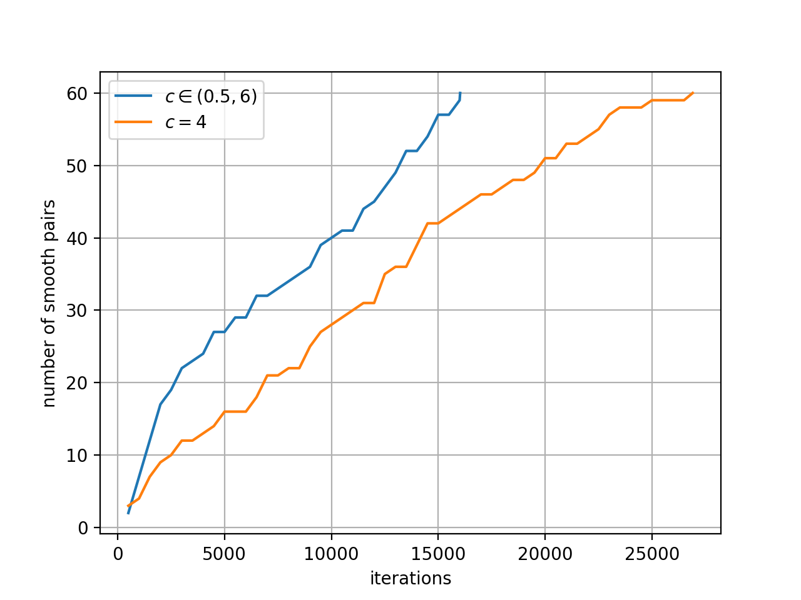

# An Implementation of "Factoring integers with sublinear resources on a superconducting quantum processor"

## Background

This project is an implementation of paper: [Yan et. al. Factoring integers with sublinear resources on a superconducting quantum processor (Dec 2022)](https://arxiv.org/abs/2212.12372).

Claus Peter Schnorr claims to destroy the RSA system in 2021. The proposed algorithm is achieved by constructing independent fac-relations from nearly shortest vectors of the lattice and distinct permutations $f$. See paper: [Fast Factoring Integers by SVP Algorithms, corrected](https://eprint.iacr.org/2021/933).

In Yan et. al.'s work, an algorithm named SQIF that use QAOA (Quantum Approximation Optimization Algorithm) to optimize the solution of Schnorr's algorithm is presented. SQIF claimed that with the integer $N$ can be factorized with sub-linear resources, specifically, with $O(\log N/ \log\log N)$ qubits, which is far less than Shor's algorithm, which needs qubits scales to $O(\log N)$.

I choose this project from [Open Source Promotion Plan \(OSPP\)](https://summer-ospp.ac.cn/) 2023.
OSPP is a summer program organized by the Institute of Software Chinese Academy of Sciences and long-term supported by the Open Source Software Supply Chain Promotion Plan.

## Related work

1. Researchers from Google Research give an implementation of in github: [google-research
/factoring_sqif](https://github.com/google-research/google-research/tree/master/factoring_sqif) with
corresponding article on arxiv: [Tanuj Khattar, Noureldin Yosri. A comment on "Factoring integers with sublinear resources on a superconducting quantum processor" (Jul 2023)](https://arxiv.org/abs/2307.09651).
Their implementation shows that the claimed sublinear lattice dimension for the hybrid quantum+classical version of Schnorr's algorithm successfully factors integers only up to 70 bits and fails to find enough factoring relations for random 80 bit integers and beyond.

2. Researchers from Russian Quantum Center also give an implementation, the corresponding paper is available on arxiv: [Pitfalls of the sublinear QAOA-based factorization algorithm (Mar 2023)](https://arxiv.org/abs/2303.04656). They argue that the proposal of Yan et. al. lacks systematic analysis of the computational complexity of the classical part of the algorithm, which exploits the Schnorr's lattice-based approach.

## My work

I reimplement the work of Yan et. al. individually. In detail, I implement the code of Schnorr's algorithm and its components, including

1. Code for Schnorr's algorithm, where the key part is LLL-reduction algorithm. Google team just use Python package [fpylll](https://github.com/fplll/fpylll), it's faster because of writing in C++ and well optimized. See file `sqif/schnorr_algorithm.py`.

2. Code for solving the linear modular(mod 2) system $(A x = b \mod 2)$ and with gaussian elimination method, and get all the solutions (instead of them) by back tracing method. See file `sqif/xor_linear_system_solver.py`.

3. Code for constructing the quantum circuit of QAOA and running the . It is implemented by [Mindspore Quantum](https://gitee.com/mindspore/mindquantum). See file `qaoa_search.py`.

## Result

In short, my result doesn't comply with that of Yan et. al. My result combined two parts. Firstly I find some mistakes of data in paper of Yan et. al. Secondly I get a better result by changing some parameters.

For mistakes in paper, I show them in file `2349a0563-project-report.md`, which is a project summary and writing in Chinese. I also try to contact the author of this paper, maybe they will give a response soon.

For super parameters, the Schnorr and Yan et. al. give different values to construct the lattices. For example, the Schnorr uses $N^{1/(n+1)}$, where $n$ is the number of primes used. While Yan et. al. use $N^c$, while $c$ is a super parameter and may vary with the size of lattice. In SQIF it's a fixed value when giving $N$, and SQIF tries to get the closest vector(corresponding to the lower energy of Hamiltonian) in each iteration. That results in a higher probability to get the same smooth pairs, while distinct smooth-pairs are needed to solve the modular linear system and get the factors of $N$. So I try to sample $c$ in a range uniformly, and don't use the QAOA or brute-force-method to get the optimal solution, it gets better results. I think the "distinct permutations $f$" in Schnorr's algorithm is to get diverse lattices so that get different smooth pairs. Searching the optimal solution just hinders the diversity.

Here an exampling is given to illustrate it. For example, we sample 60 smooth pairs to factorize $N=78742675849$, more 16,000 steps is needed if we use fixed $c=4$, while less than 16,000 iterations if we use uniformly sampling $c$ from interval $(0.5, 6)$.

However, how can we set the range of $c$ how to design the map $f$ in Schnorr's algorithm is still unknown. We can only conclude that diversity is better.

## Reference

[1] [Bao Yan, Ziqi Tan, Shijie Wei, Haocong Jiang, Weilong Wang, Hong Wang, Lan Luo, Qianheng Duan, Yiting Liu, Wenhao Shi, Yangyang Fei, Xiangdong Meng, Yu Han, Zheng Shan, Jiachen Chen, Xuhao Zhu, Chuanyu Zhang, Feitong Jin, Hekang Li, Chao Song, Zhen Wang, Zhi Ma, H. Wang, and Gui-Lu Long. Factoring integers with sublinear resources on a superconducting quantum processor. Nov 2022](https://arxiv.org/abs/2212.12372)

[2] [Claus Peter Schnorr, Fast Factoring Integers by SVP Algorithms, corrected. Jul 2021.](https://eprint.iacr.org/2021/933)

[3] [Tanuj Khattar, Noureldin Yosri. A comment on "Factoring integers with sublinear resources on a superconducting quantum processor". Jul 2023.](https://arxiv.org/abs/2307.09651)

[4] [S.V. Grebnev, M.A. Gavreev, E.O. Kiktenko, A.P. Guglya, A.K. Fedorov, Pitfalls of the sublinear QAOA-based factorization algorithm. Mar 2023.](https://arxiv.org/abs/2303.04656)
